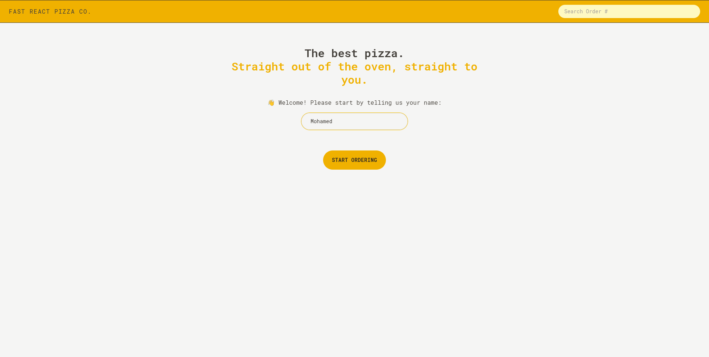
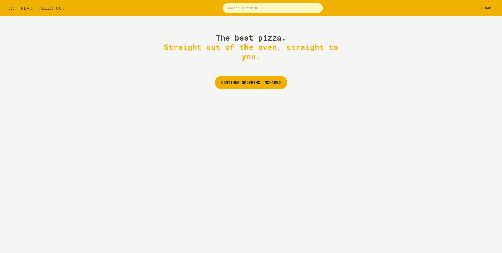
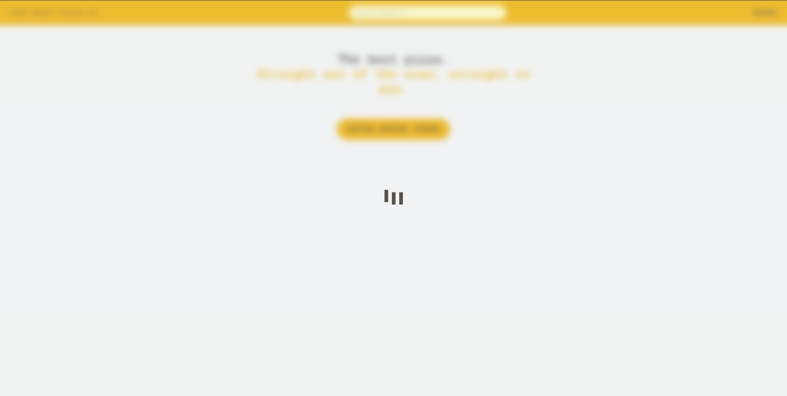
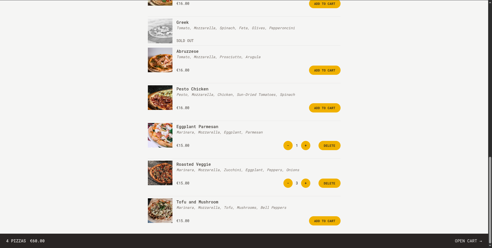
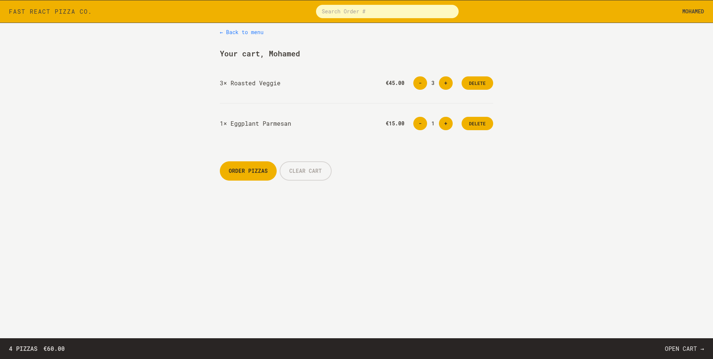
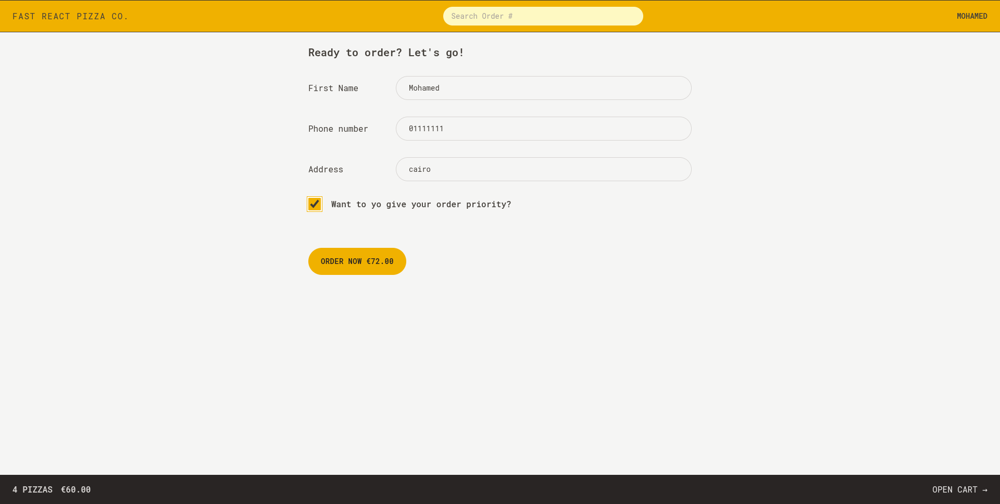
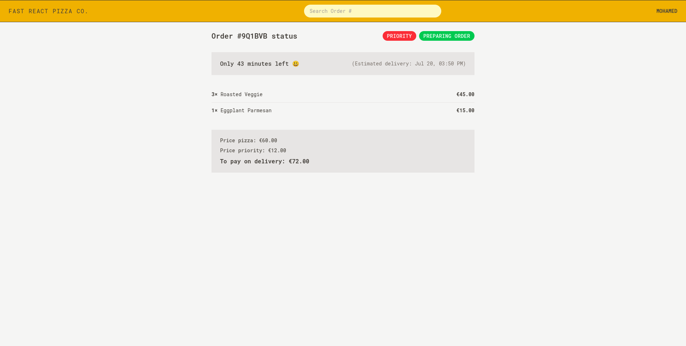

# 🍕 Fast React Pizza

Fast React Pizza is a modern and responsive single-page pizza ordering app built using **React**, **Vite**, and **Redux Toolkit**. The app simulates an interactive pizza delivery experience — allowing users to browse a menu, customize their order, and track it in real time.

This project is part of a practice module focused on mastering React, Redux state management, and scalable app architecture. It also emphasizes reusable components and clean UI structure.

---

##  Project Preview

<!-- You can upload a screenshot or demo gif and paste its markdown link here -->








---

##  Features Implemented

✅ Browse a list of available pizzas  
✅ Add pizzas to a cart  
✅ Adjust pizza quantities or remove them  
✅ Create an order with your name  
✅ Search and view your order using the order ID  
✅ Simulate order status (e.g., preparing, delivered)  
✅ Global state management with Redux Toolkit  
✅ Routing and layout with reusable UI components  
✅ Responsive design with fast loading using Vite  

---

## 📁 Project Structure

```css
├── src/
├── App.jsx
├── main.jsx
├── index.css
├── store.js
├── features/
│ ├── cart/ # Handles cart logic & UI
│ ├── menu/ # Renders the pizza menu
│ ├── order/ # Order creation & tracking
│ └── user/ # User info & persistence
├── ui/ # Layout & reusable components
└── utils/ # Helper functions (e.g., format price)
```

## Tech Stack
- React (with Hooks)

- Redux Toolkit

- Vite (as the build tool)

- Tailwind CSS

- ESLint & Prettier (for code formatting)

## What’s Implemented
- Modular feature-based folder structure

- Clean routing and layout components

- User flow: Add name → Select pizza → Checkout → View order

- Helper utilities for formatting and calculation

- Clean state management using Redux Toolkit slices
